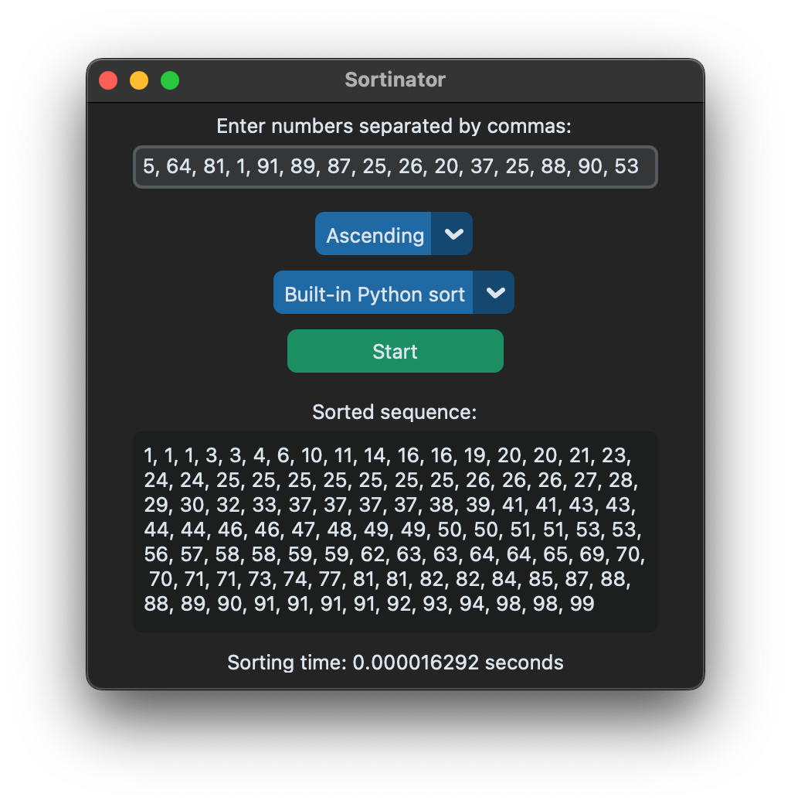

Languages: ENG, [RU](./README_RU.md)

# Sortinator

Beautiful GUI application for sorting numbers with algorithm selection and sorting time output, **for fun** :)

<div align="center">
  
</div>

# Installation and Usage

> [!IMPORTANT]
> Minimum requirement [python 3.8](https://www.python.org/downloads/).
>
> This project uses [rye](https://rye.astral.sh) for dependency management, it assumes you have installed it.


1. Clone the repository
    ```bash
    git clone https://github.com/MrPandir/sortinator.git && cd sortinator
    ```
2. Install dependencies

    This will automatically create the virtual environment in the `.venv` directory and install the required dependencies
    ```bash
    rye sync
    ```
    <details>
    <summary>Alternative install via pip</summary>
    Create a virtual environment and activate:

    ```bash
    python3 -m venv .venv && source .venv/bin/activate
    ```
    Install only the required dependencies:

    ```bash
    pip3 install -r requirements.lock
    ```
    </details>
3. Run the application
  ```bash
  python main.py # OR rye run app
  ```

# Run Tests

## Using Rye
```bash
rye run test
```
## Using Python's unittest module directly
```bash
python3 -m unittest discover -s tests -v
```

> [!TIP]
> This method is useful if you're not using Rye or want more control over the test discovery process.

# Project Requirements

## User Interface
- Input field for numbers (with instructions to enter comma-separated values)
- Dropdown menu for sorting type selection: "Ascending" and "Descending"
- "Start" button to initiate sorting
- Output field for displaying the sorted sequence
- Field for showing the time taken for sorting

## Program Logic
1. User enters a sequence of numbers separated by commas
2. User selects the sorting type (ascending or descending) from the dropdown menu
3. User clicks the "Start" button to begin the sorting process
4. After sorting is complete, the result is displayed in the text field along with the time taken for sorting

## Code Requirements
- Handle potential input errors (e.g., non-numeric input or empty input)
- Document the code: describe classes, methods, and key steps using comments
- Utilize the unittest library to create tests that verify sorting correctness and exception handling

## Additional Features
- Calculate and display the execution time of the sorting process
- Selection of different sorting algorithms
