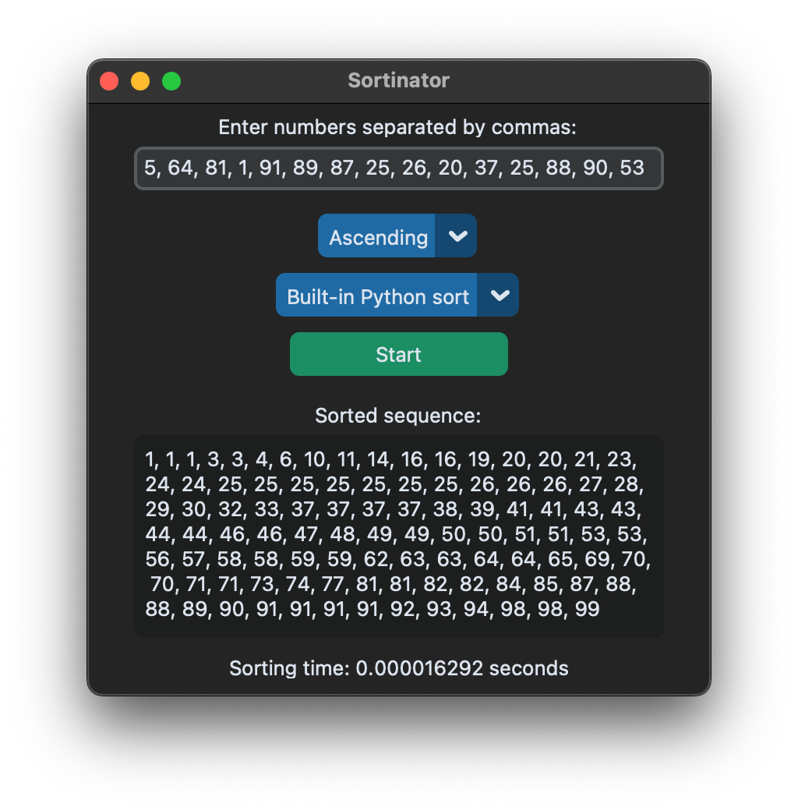

Языки: [ENG](./README.md), RU

# Сортинатор

Красивое GUI-приложение для сортировки чисел с выбором алгоритма и выводом времени сортировки, **по фану** :)

<div align="center">
  
</div>

# Установка и использование

> [!IMPORTANT]
> Минимальное требование [python 3.8](https://www.python.org/downloads/).
>
> Этот проект использует [rye](https://rye.astral.sh) для управления зависимостями, предполагается, что вы его установили.


1. Клонируйте репозиторий
    ```bash
    git clone https://github.com/MrPandir/sortinator.git && cd sortinator
    ```
2. Установите зависимости

    Это автоматически создаст виртуальное окружение в директории `.venv` и установит необходимые зависимости
    ```bash
    rye sync
    ```
    <details>
    <summary>Альтернативная установка через pip</summary>
    Создайте виртуальное окружение и активируйте его:

    ```bash
    python3 -m venv .venv && source .venv/bin/activate
    ```
    Установите только необходимые зависимости:

    ```bash
    pip3 install -r requirements.lock
    ```
    </details>
3. Запустите приложение
  ```bash
  python main.py # ИЛИ rye run app
  ```

# Запуск тестов

## С использованием Rye
```bash
rye run test
```
## С использованием модуля unittest Python напрямую
```bash
python3 -m unittest discover -s tests -v
```

> [!TIP]
> Этот метод полезен, если вы не используете Rye или хотите больше контроля над процессом обнаружения тестов.

# Требования к проекту

## Пользовательский интерфейс
- Поле ввода для чисел (с инструкциями по вводу значений, разделенных запятыми)
- Выпадающее меню для выбора типа сортировки: "Сортировка по возрастанию" и "Сортировка по убыванию"
- Кнопка "Старт" для начала сортировки
- Поле вывода для отображения отсортированной последовательности
- Поле для отображения времени, затраченного на сортировку

## Логика программы
1. Пользователь вводит последовательность чисел, разделенных запятыми
2. Пользователь выбирает тип сортировки (по возрастанию или убыванию) из выпадающего меню
3. Пользователь нажимает кнопку "Старт" для начала процесса сортировки
4. После завершения сортировки результат отображается в текстовом поле вместе с временем, затраченным на сортировку

## Требования к коду
- Обработка потенциальных ошибок ввода (например, нечисловой ввод или пустой ввод)
- Документирование кода: описание классов, методов и ключевых шагов с помощью комментариев
- Использование библиотеки unittest для создания тестов, проверяющих корректность сортировки и обработку исключений

## Дополнительные функции
- Расчет и отображение времени выполнения процесса сортировки
- Выбор разных алгоритмов сортировки
